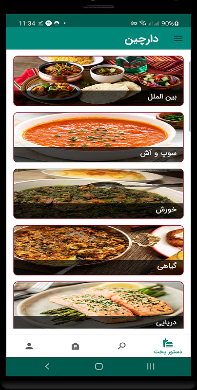
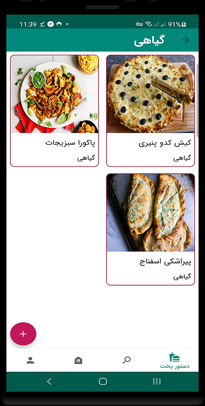
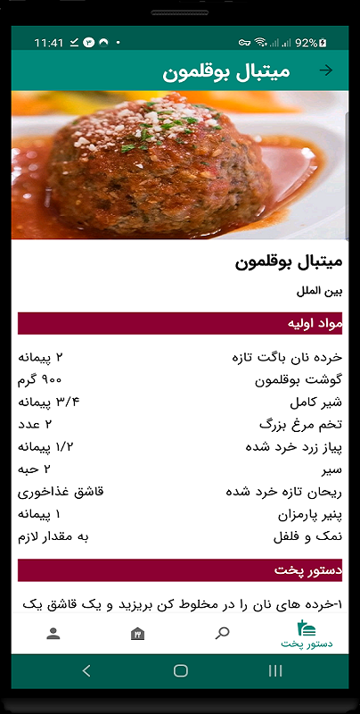
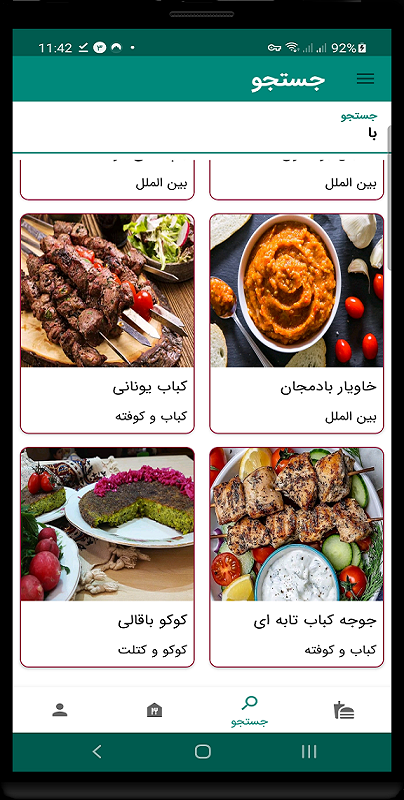

<h1 align="center"> FoodTest </h1>
<br>
<p align="center">
    
</p>


showcase for Room database


#### `Screenshot` 

<p align="center">
  
   
  <br>
   
   
  </p>
  
  

### `Tools & Dependencies`
* Clean Ahitecture(MVVM)
* Single Activity
* Google Material Design
* Jetpack Navigation Component
* Jetpack Room Database
* Glide - Load Image
* Dagger- Dependency Injection
* RxJava/RxAndroid- Reacttive Programming
* Kotlin DSL

 
 
 ## Build/Running
- Create local.properties in root folder
- Add the following parameters :
```
    signing.key.alias="<INSERT_YOUR_ALIAS>"
    signing.key.password="<INSERT_YOUR_PASSWORD>"
    signing.store.file="<INSERT_YOUR_ADDRESS>"
    signing.store.password="<INSERT_YOUR_PASSWORD>"
```
 

[](#)

- Github Release page: [Releases](https://github.com/OmidTaheri/FoodTest/releases)


[](https://www.linkedin.com/in/omid-taheri)
